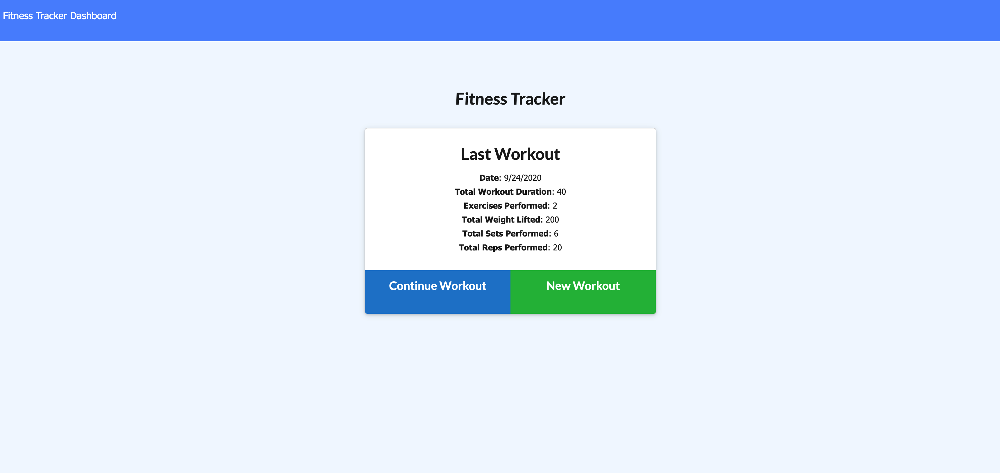
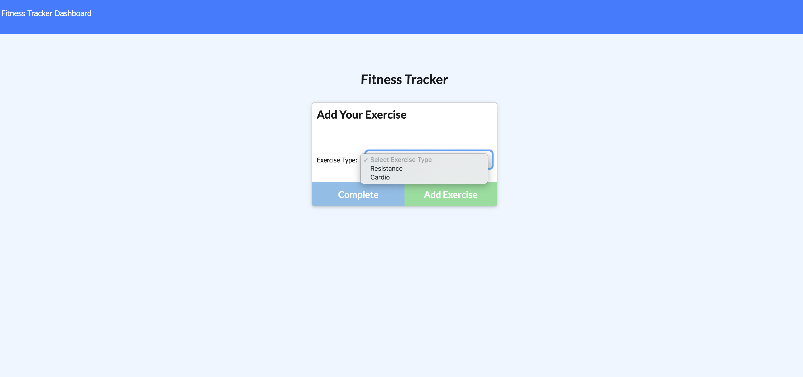
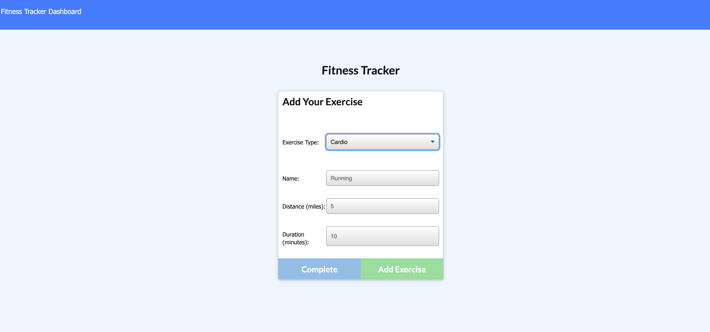
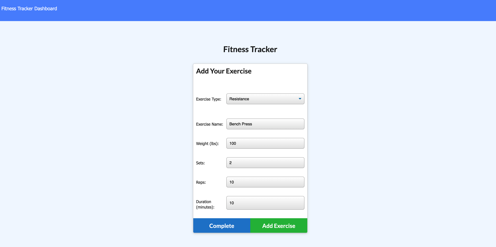
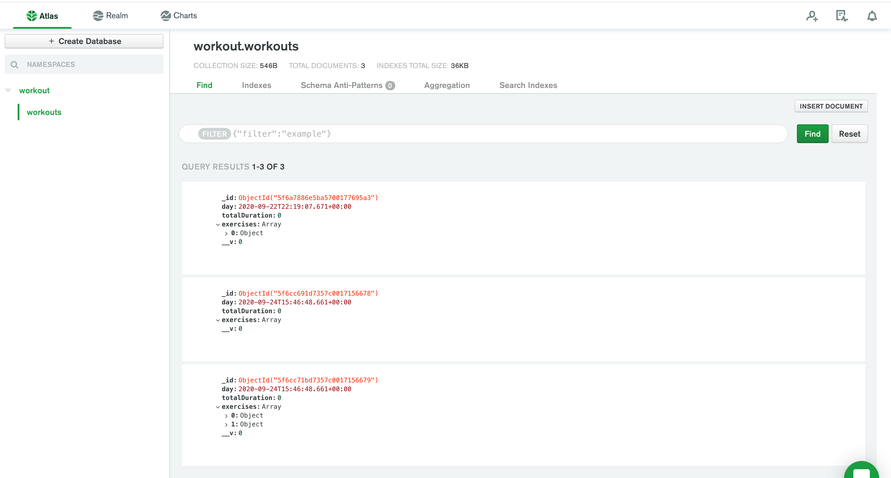

## Nosql : Workout Tracker

This assignment is based on creating a  workout tracker. Major task is to create Mongo database with a Mongoose schema and handle routes with Express.

### User Story

* As a user, I want to be able to view create and track daily workouts. I want to be able to log multiple exercises in a workout on a given day. I should also be able to track the name, type, weight, sets, reps, and duration of exercise. If the exercise is a cardio exercise, I should be able to track my distance traveled.

### Business Context

A consumer will reach their fitness goals more quickly when they track their workout progress.

### Prerequisite 

To execute the login application, the user must first install node JS

Steps to Install NodeJS: [Node.js Installation](https://docs.npmjs.com/downloading-and-installing-node-js-and-npm#windows-node-version-managers)

After installing Node.js, to install NPM node module dependencies, run the command:
`NPM Install`

### NPM Module
 
Express - Express is a minimal and flexible Node.js application framework that provides a robust set of features for web and mobile applications. Used express server for this project and also sets up the express app to handle data parsing.
Mongoose - Mongoose provides a straight-forward, schema-based solution to model your application data. It includes built-in type casting, validation, query building, business logic hooks and more, out of the box.
Morgan -  Morgan is a middleware that allows us to easily log requests, errors, and more to the console. It’s easy to use, but still powerful and customizable.

### Description

When the user loads the page, they should be given the option to create a new workout or continue with their last workout.

The user should be able to:

  * Add exercises to a previous workout plan.

  * Add new exercises to a new workout plan.

  * View the combined weight of multiple exercises on the `stats` page.

### Screenshots

Here's the link to my developed Website : [Workout Tracker](https://mongoose-workouttracker.herokuapp.com/)

#### References

FindOneAndUpdate : [FindOneAndUpdate Documentation](https://mongoosejs.com/docs/tutorials/findoneandupdate.html) 
Update Validators : [Update Validators Reference](https://mongoosejs.com/docs/validation.html#update-validators) 
StackOverflow : [Stack Overflow - Deprecation Warning](https://stackoverflow.com/questions/52572852/deprecationwarning-collection-findandmodify-is-deprecated-use-findoneandupdate)